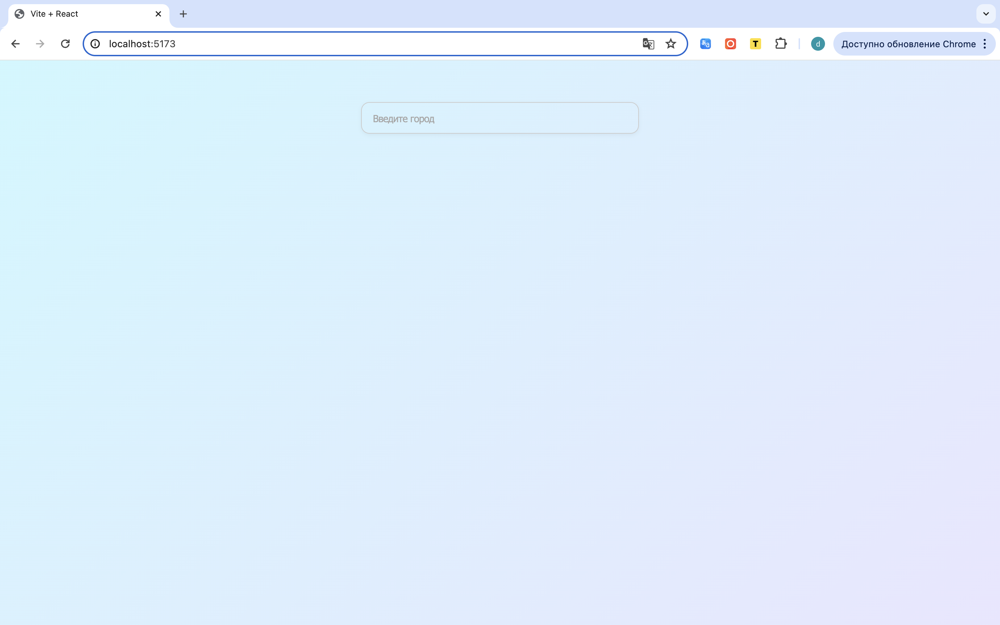
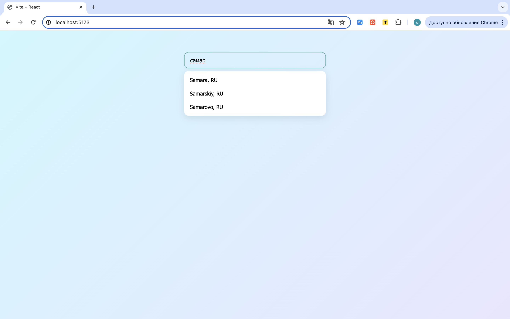
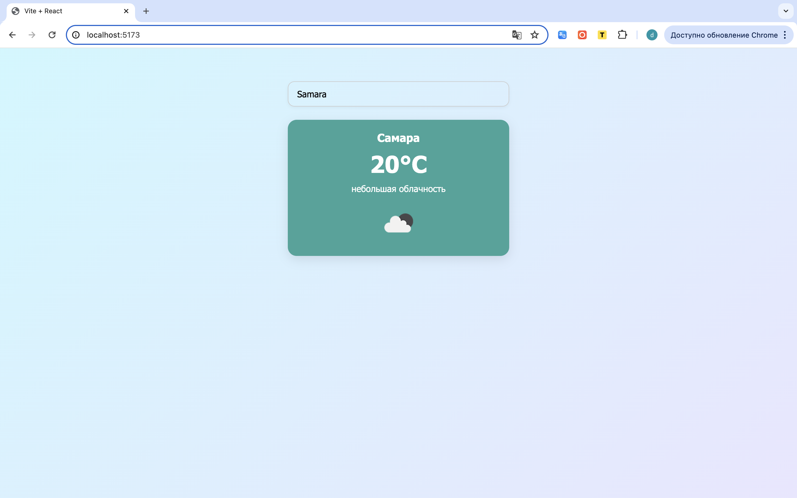

# Weather App

React-приложение для поиска городов и просмотра текущей погоды с использованием OpenWeather API.

---

## Возможности
- Поиск города с автоподсказками (до 5 вариантов).
- Выбор города из списка и автоматическая загрузка его погоды.
- Отображение:
  - Названия города
  - Температуры (°C)
  - Описания погоды на русском
  - Иконки состояния погоды
- Адаптивный интерфейс с подсказками и карточкой погоды.

---

## Технологии
- React (хуки: `useState`, `useEffect`)
- CSS Modules для стилей
- OpenWeather API ([https://openweathermap.org](https://openweathermap.org))

---

## 📸 Скриншоты

### Страница при загрузке

### Поиск города

### Обзор погоды в выбранном  городе

